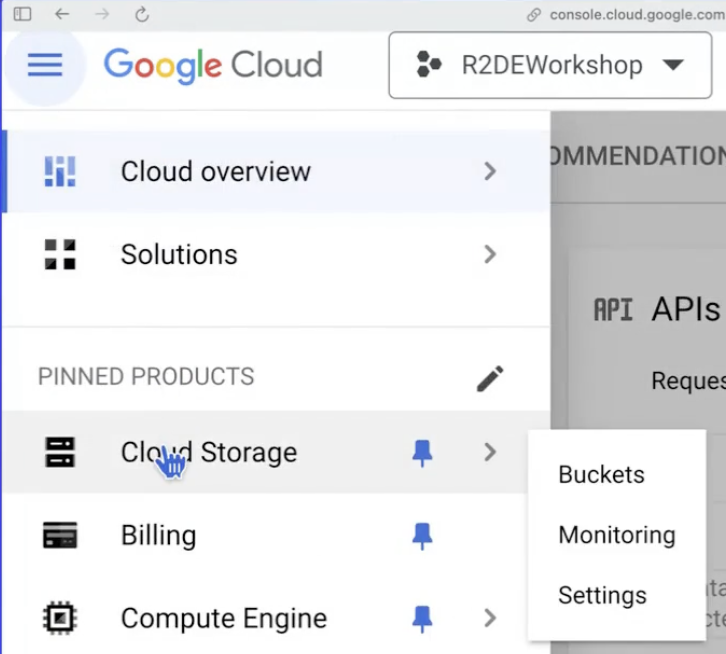
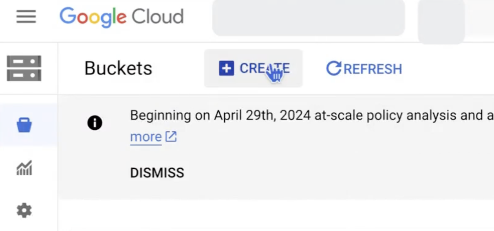
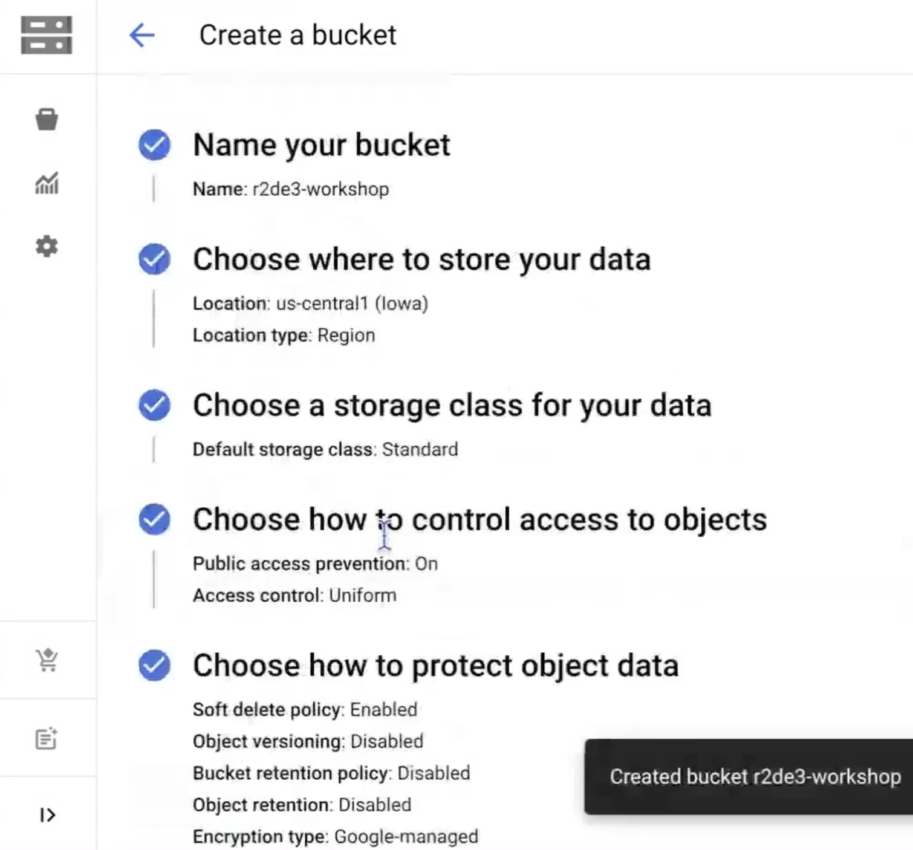
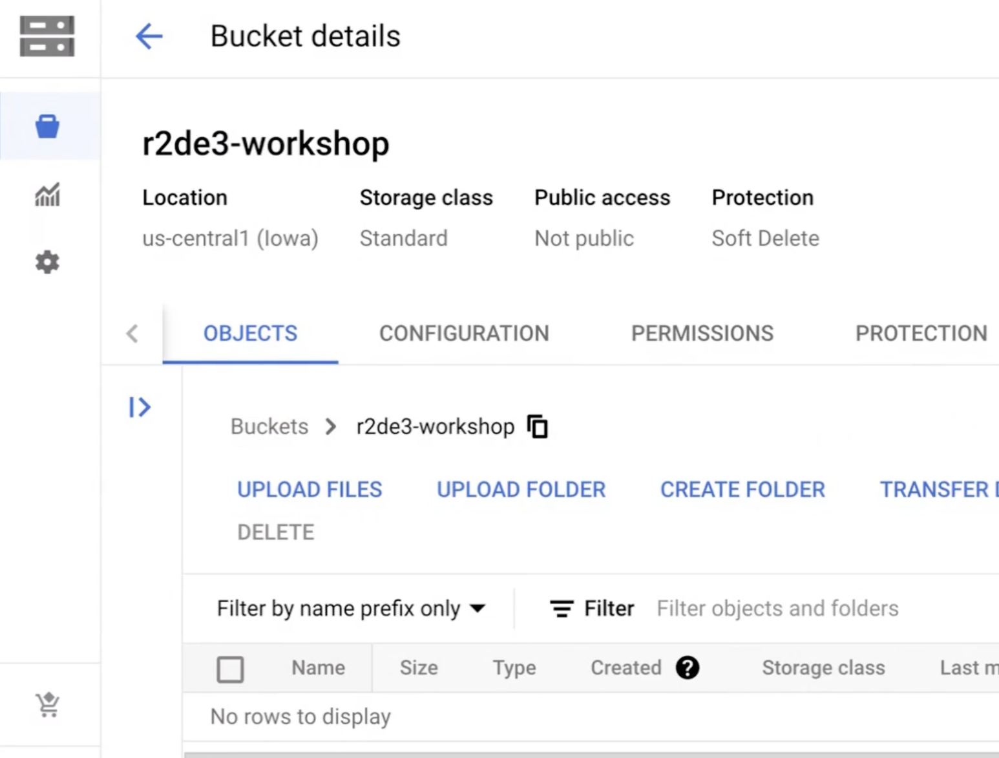
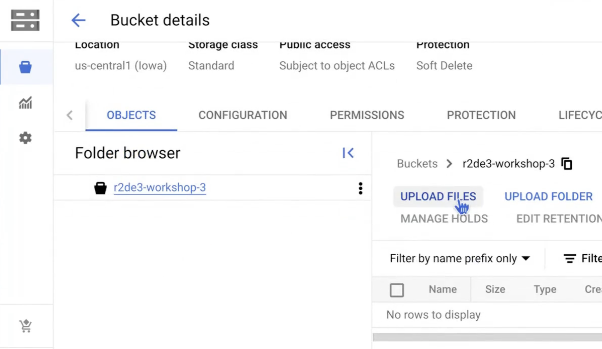
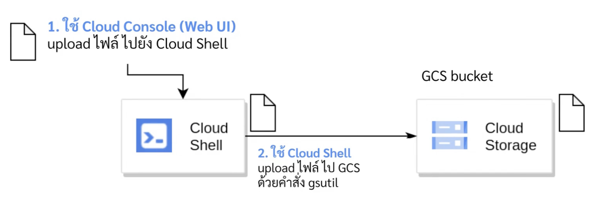
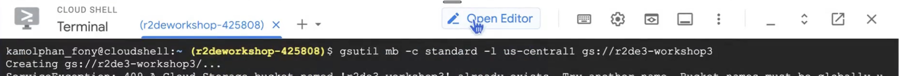

# Data Storage
## Step 1: Creating a Bucket
### Method 1: Using the Cloud Console via the web UI









### Method 2: Using the gsutil command via Cloud Shell
Use the Cloud Shell Terminal
```sh
$ gsutil
```
`--help` shows how to use that command
```sh
$ gsutil mb --help
```
Create a bucket via the command line

```sh
$ gsutil mb -c standard -l us-central1 gs://r2de3-workshop-3
```
---

## Step 2: Upload data
### Method 1: Upload via Cloud Console using the web UI


### Method 2: Use the gsutil command via Cloud Shell
Using Cloud Shell to run `gsutil` commands to manage Google Cloud Storage.

When uploading files from your local machine to Google Cloud Storage, you first need to upload the files to Cloud Shell, and then use Cloud Shell to upload them to Google Cloud Storage with the `gsutil` command.



`$ ls` on the command line on our local machine: Used to list files and folders in the current directory on our local machine.
```sh
$ ls
```
`$ ls` in Cloud Shell: Used to list files and folders in the Cloud Shell VM.
```sh
$ ls
```
`$ gsutil ls` in Cloud Shell: Used to list buckets and objects in Google Cloud Storage.
```sh
$ gsutil ls [BUCKET_NAME]
```

Use the gsutil cp command to upload a file
```sh
$ gsutil cp [LOCAL_FILE_PATH] gs://[BUCKET_NAME]/
```
Example:
```sh
$ gsutil cp README-cloudshell.txt gs://r2de3-workshop-3
```
### Method 3: Use Python code via the Python SDK library
Open cloud shell editor



Create workshop3.py and use [upload](https://docs.cloud.google.com/storage/docs/uploading-objects#storage-upload-object-python) and [download](https://docs.cloud.google.com/storage/docs/downloading-objects#storage-download-object-python) to manage objects in a bucket via Python client libraries.

```sh
from google.cloud import storage


def upload_blob(bucket_name, source_file_name, destination_blob_name):
    """Uploads a file to the bucket."""
    # The ID of your GCS bucket
    # bucket_name = "your-bucket-name"
    # The path to your file to upload
    # source_file_name = "local/path/to/file"
    # The ID of your GCS object
    # destination_blob_name = "storage-object-name"

    storage_client = storage.Client()
    bucket = storage_client.bucket(bucket_name)
    blob = bucket.blob(destination_blob_name)

    # Optional: set a generation-match precondition to avoid potential race conditions
    # and data corruptions. The request to upload is aborted if the object's
    # generation number does not match your precondition. For a destination
    # object that does not yet exist, set the if_generation_match precondition to 0.
    # If the destination object already exists in your bucket, set instead a
    # generation-match precondition using its generation number.
    generation_match_precondition = 0

    blob.upload_from_filename(source_file_name, if_generation_match=generation_match_precondition)

    print(
        f"File {source_file_name} uploaded to {destination_blob_name}."
    )


def download_blob(bucket_name, source_blob_name, destination_file_name):
    """Downloads a blob from the bucket."""
    # The ID of your GCS bucket
    # bucket_name = "your-bucket-name"

    # The ID of your GCS object
    # source_blob_name = "storage-object-name"

    # The path to which the file should be downloaded
    # destination_file_name = "local/path/to/file"

    storage_client = storage.Client()

    bucket = storage_client.bucket(bucket_name)

    # Construct a client side representation of a blob.
    # Note `Bucket.blob` differs from `Bucket.get_blob` as it doesn't retrieve
    # any content from Google Cloud Storage. As we don't need additional data,
    # using `Bucket.blob` is preferred here.
    blob = bucket.blob(source_blob_name)
    blob.download_to_filename(destination_file_name)

    print(
        "Downloaded storage object {} from bucket {} to local file {}.".format(
            source_blob_name, bucket_name, destination_file_name
        )
    )

if __name__ == "__main__"
mode = input("Upload (u) or Download (d)?")
bucket_name = input("Please enter bucket name:")
source_file = input("Please enter source file:")
destination = input("Please enter destination file (leave blank if use the same name):")
if destination is None or destination == "":
    destination = source_file.split("/")[-1]

if mode.strip().lower() == "upload" or mode.strip().lower() == "u":
    upload_blob(bucket_name,source_file,destination)
elif mode.strip().lower() == "download" or mode.strip().lower() == "d":
    download_blob(bucket_name,source_file,destination)
else:
    print("invalid command")
```

run python file in Cloud Shell
```sh
$ python workshop3.py
```