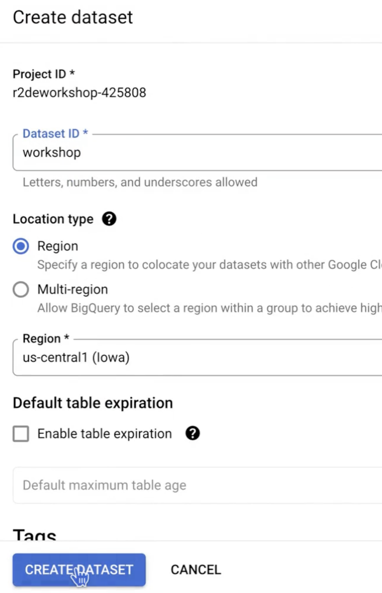
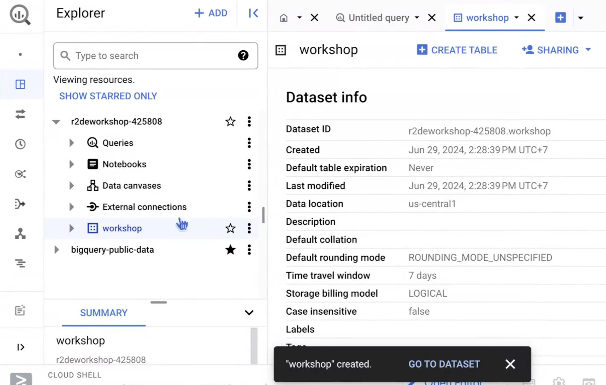
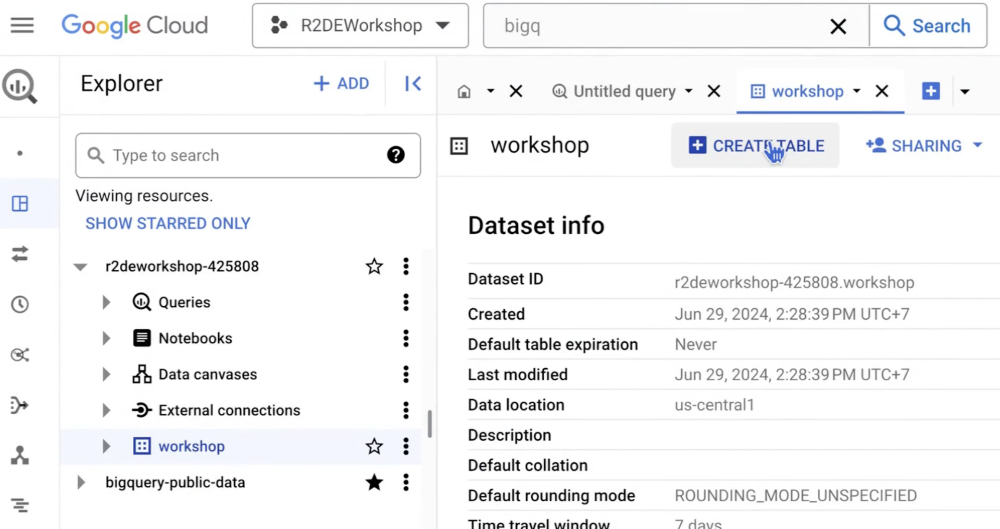
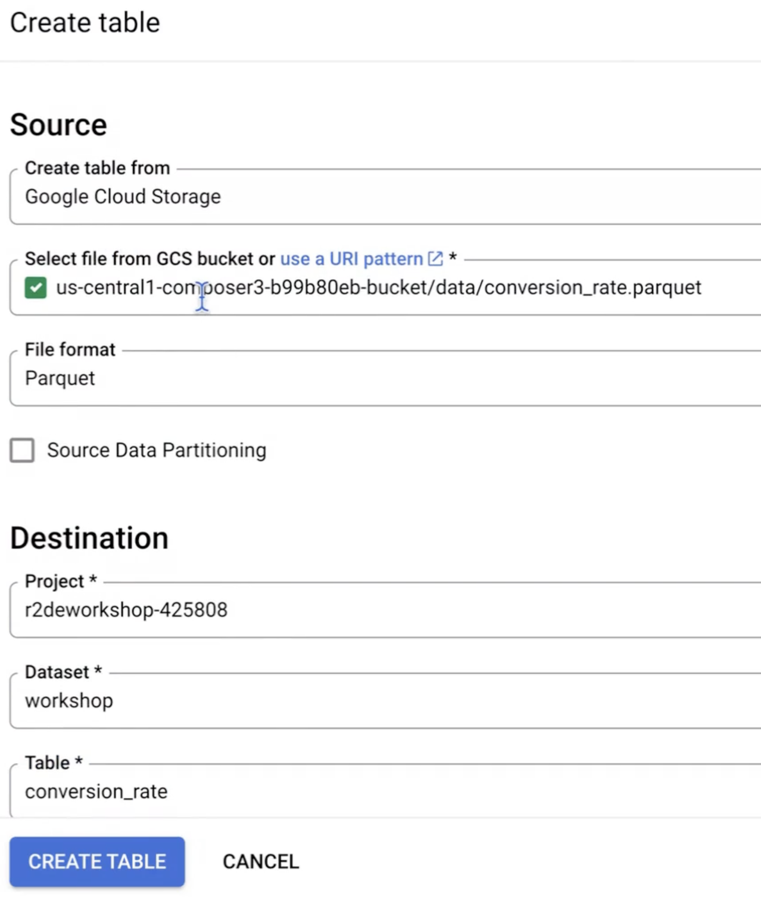
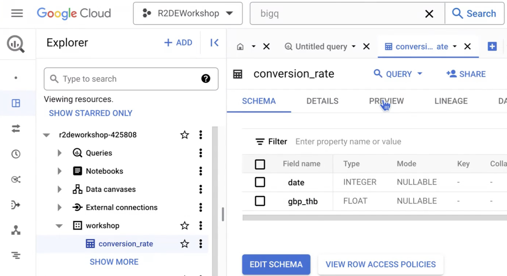
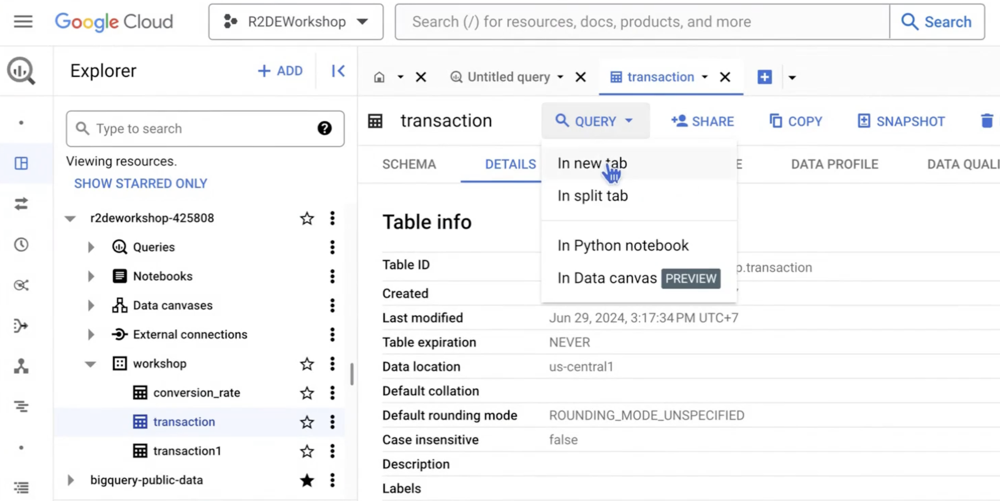
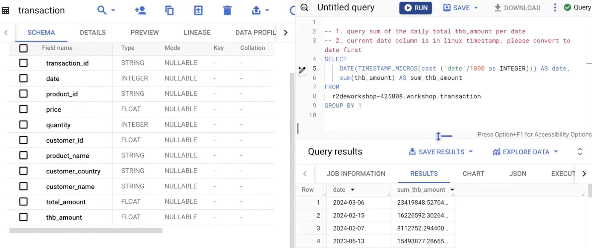

# 5. Data Warehouse
## Step 1: Create dataset
Note: The dataset in BigQuery must be in the same region as Cloud Composer.





---

## Step 2: Import data
### Method 1: Import using the Cloud Console (web-based UI)




### Method 2: Import using the bq command via Airflow BashOperator 
```sh
from airflow.models import DAG
from airflow.decorators import dag, task
from airflow.operators.bash import BashOperator
from airflow.providers.mysql.hooks.mysql import MySqlHook
from airflow.utils.dates import days_ago
import pandas as pd
import requests


MYSQL_CONNECTION = "mysql_default"   # Name of the Airflow connection that has been configured
CONVERSION_RATE_URL = "https://r2de3-currency-api-vmftiryt6q-as.a.run.app/gbp_thb"

# Output paths for saving files
mysql_output_path = "/home/airflow/gcs/data/transaction_data_merged.parquet"
conversion_rate_output_path = "/home/airflow/gcs/data/conversion_rate.parquet"
final_output_path = "/home/airflow/gcs/data/workshop4_output.parquet"

default_args = {
    'owner': 'datath',
}


@task()
def get_data_from_mysql(output_path):
    # Receive output_path from the calling task

    # Use MySqlHook to connect to MySQL via the configured Airflow connection
    mysqlserver = MySqlHook(MYSQL_CONNECTION)
    
    # Query data from the database using the created Hook, returning results as pandas DataFrames
    product = mysqlserver.get_pandas_df(sql="SELECT * FROM r2de3.product")
    customer = mysqlserver.get_pandas_df(sql="SELECT * FROM r2de3.customer")
    transaction = mysqlserver.get_pandas_df(sql="SELECT * FROM r2de3.transaction")

    # Merge data from two DataFrames as in Workshop 1
    merged_transaction = (
        transaction
        .merge(product, how="left", on="ProductNo")
        .merge(customer, how="left", on="CustomerNo")
    )
    
    # Save the parquet file to the provided output_path
    # The file will be automatically stored in GCS
    merged_transaction.to_parquet(output_path, index=False)
    print(f"Output to {output_path}")


@task()
def get_conversion_rate(output_path):
    # Send a request to retrieve data from CONVERSION_RATE_URL
    r = requests.get(CONVERSION_RATE_URL)
    result_conversion_rate = r.json()
    df = pd.DataFrame(result_conversion_rate)
    df = df.drop(columns=['id'])

    # Convert the column to date format and save as a parquet file
    df['date'] = pd.to_datetime(df['date'])
    df.to_parquet(output_path, index=False)
    print(f"Output to {output_path}")


@task()
def merge_data(transaction_path, conversion_rate_path, output_path):
    # Read from files; note that the paths come from the received parameters
    transaction = pd.read_parquet(transaction_path)
    conversion_rate = pd.read_parquet(conversion_rate_path)

    # Merge the two DataFrames
    final_df = transaction.merge(
        conversion_rate,
        how="left",
        left_on="Date",
        right_on="date"
    )
    
    # Convert price into total_amount and thb_amount
    final_df["total_amount"] = final_df["Price"] * final_df["Quantity"]
    final_df["thb_amount"] = final_df["total_amount"] * final_df["gbp_thb"]

    # Drop unused columns and rename columns
    final_df = final_df.drop(["date", "gbp_thb"], axis=1)

    final_df.columns = [
        'transaction_id', 'date', 'product_id', 'price', 'quantity',
        'customer_id', 'product_name', 'customer_country',
        'customer_name', 'total_amount', 'thb_amount'
    ]

    # Save the parquet file
    final_df.to_parquet(output_path, index=False)
    print(f"Output to {output_path}")
    print("== End of Workshop 4 ʕ•́ᴥ•̀ʔっ♡ ==")


@dag(
    default_args=default_args,
    schedule_interval="@once",
    start_date=days_ago(1),
    tags=["workshop"]
)
def workshop5_bash():
    """
    Workshop 5
    In this workshop, data is loaded into BigQuery using a bash command (bq load)
    via the BashOperator.
    """
    
    t1 = get_data_from_mysql(output_path=mysql_output_path)
    t2 = get_conversion_rate(output_path=conversion_rate_output_path)
    t3 = merge_data(
        transaction_path=mysql_output_path,
        conversion_rate_path=conversion_rate_output_path,
        output_path=final_output_path
    )

    # Create t4 using BashOperator to load data into BigQuery and define dependencies
    t4 = BashOperator(
        task_id="bq_load",
        bash_command=(
            "bq load --source_format=PARQUET "
            "workshop.transaction1 "
            "gs://us-central1-workshop5-d8d1adac-bucket/data/workshop4_output.parquet"
        ),
    )
    
    [t1, t2] >> t3 >> t4


workshop5_bash()

```

Use the gsutil cp command to upload a file
```sh
$ gsutil cp [LOCAL_FILE_PATH] gs://[BUCKET_NAME]/
```
Example:
```sh
$ gsutil cp workshop5_bq_load.py gs://us-central1-workshop5-d8d1adac-bucket/dags
```

### Method 3: Import using GCSToBigQueryOperator in Airflow 
```sh
from airflow.models import DAG
from airflow.decorators import dag, task
from airflow.providers.google.cloud.transfers.gcs_to_bigquery import GCSToBigQueryOperator
from airflow.providers.mysql.hooks.mysql import MySqlHook
from airflow.utils.dates import days_ago
import pandas as pd
import requests


MYSQL_CONNECTION = "mysql_default"   # Name of the Airflow connection that has been configured
CONVERSION_RATE_URL = "https://r2de3-currency-api-vmftiryt6q-as.a.run.app/gbp_thb"

# Output paths for saving files
mysql_output_path = "/home/airflow/gcs/data/transaction_data_merged.parquet"
conversion_rate_output_path = "/home/airflow/gcs/data/conversion_rate.parquet"
final_output_path = "/home/airflow/gcs/data/workshop4_output.parquet"

default_args = {
    'owner': 'datath',
}


@task()
def get_data_from_mysql(output_path):
    # Receive output_path from the calling task

    # Use MySqlHook to connect to MySQL via the configured Airflow connection
    mysqlserver = MySqlHook(MYSQL_CONNECTION)
    
    # Query data from the database using the Hook, returning results as pandas DataFrames
    product = mysqlserver.get_pandas_df(sql="SELECT * FROM r2de3.product")
    customer = mysqlserver.get_pandas_df(sql="SELECT * FROM r2de3.customer")
    transaction = mysqlserver.get_pandas_df(sql="SELECT * FROM r2de3.transaction")

    # Merge data from two DataFrames as in Workshop 1
    merged_transaction = (
        transaction
        .merge(product, how="left", on="ProductNo")
        .merge(customer, how="left", on="CustomerNo")
    )
    
    # Save the parquet file to the provided output_path
    # The file will be automatically stored in GCS
    merged_transaction.to_parquet(output_path, index=False)
    print(f"Output to {output_path}")


@task()
def get_conversion_rate(output_path):
    # Send a request to retrieve data from CONVERSION_RATE_URL
    r = requests.get(CONVERSION_RATE_URL)
    result_conversion_rate = r.json()
    df = pd.DataFrame(result_conversion_rate)
    df = df.drop(columns=['id'])

    # Convert the column to date format and save as a parquet file
    df['date'] = pd.to_datetime(df['date'])
    df.to_parquet(output_path, index=False)
    print(f"Output to {output_path}")


@task()
def merge_data(transaction_path, conversion_rate_path, output_path):
    # Read from files using paths received as parameters
    transaction = pd.read_parquet(transaction_path)
    conversion_rate = pd.read_parquet(conversion_rate_path)

    # Merge the two DataFrames
    final_df = transaction.merge(
        conversion_rate,
        how="left",
        left_on="Date",
        right_on="date"
    )
    
    # Convert price into total_amount and thb_amount
    final_df["total_amount"] = final_df["Price"] * final_df["Quantity"]
    final_df["thb_amount"] = final_df["total_amount"] * final_df["gbp_thb"]

    # Drop unused columns and rename columns
    final_df = final_df.drop(["date", "gbp_thb"], axis=1)

    final_df.columns = [
        'transaction_id', 'date', 'product_id', 'price', 'quantity',
        'customer_id', 'product_name', 'customer_country',
        'customer_name', 'total_amount', 'thb_amount'
    ]

    # Save the final parquet file
    final_df.to_parquet(output_path, index=False)
    print(f"Output to {output_path}")
    print("== End of Workshop 4 ʕ•́ᴥ•̀ʔっ♡ ==")


@dag(
    default_args=default_args,
    schedule_interval="@once",
    start_date=days_ago(1),
    tags=["workshop"]
)
def workshop5():
    """
    Workshop 5
    This workshop loads data into BigQuery using Airflow's GCSToBigQueryOperator
    """
    
    t1 = get_data_from_mysql(output_path=mysql_output_path)
    t2 = get_conversion_rate(output_path=conversion_rate_output_path)
    t3 = merge_data(
        transaction_path=mysql_output_path,
        conversion_rate_path=conversion_rate_output_path,
        output_path=final_output_path
    )

    # Create t4 using GCSToBigQueryOperator to load data into BigQuery and define dependencies
    t4 = GCSToBigQueryOperator(
        task_id="gcs_to_bigquery",
        bucket="us-central1-workshop5-d8d1adac-bucket",
        source_objects=["data/workshop4_output.parquet"],
        source_format="PARQUET",
        destination_project_dataset_table="workshop.transaction",
        write_disposition="WRITE_TRUNCATE"
    )

    [t1, t2] >> t3 >> t4


workshop5()

```

Use the gsutil cp command to upload a file
```sh
$ gsutil cp [LOCAL_FILE_PATH] gs://[BUCKET_NAME]/
```
Example:
```sh
$ gsutil cp workshop5_gcs_to_bq.py gs://us-central1-workshop5-d8d1adac-bucket/dags
```

---

## Step 3: Explore data on BigQuery using SQL 

