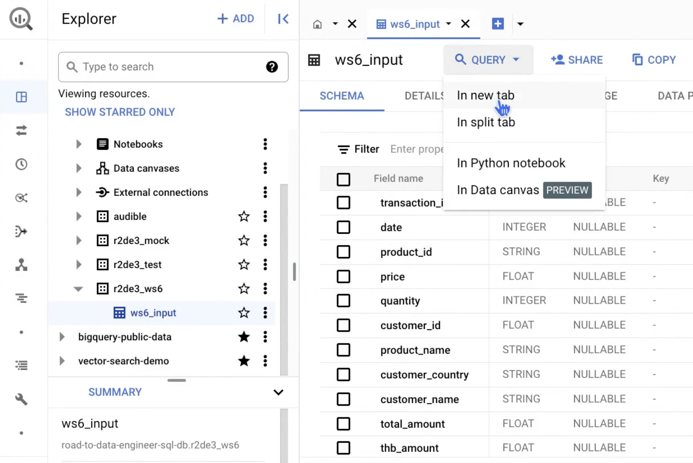
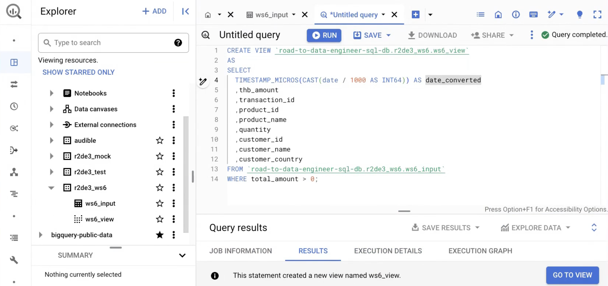
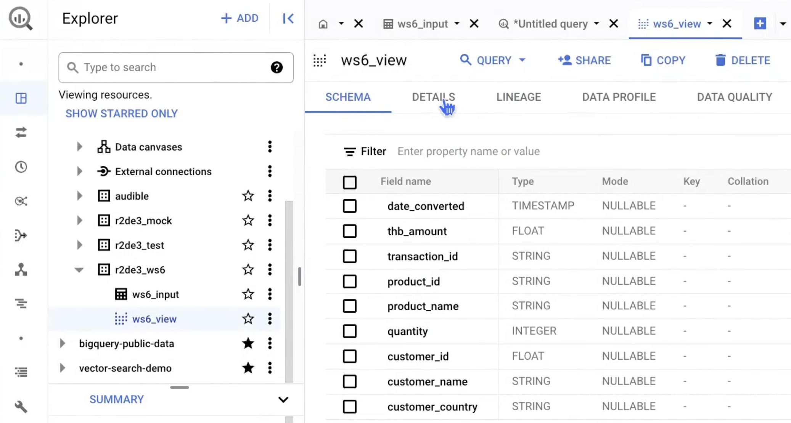

# 6. Dashboard
## Step 1: Create a view to provide a specific subset of data for visualization 

Code for creating a view (replace the Project and Dataset names with your own)

```sh
CREATE VIEW `road-to-data-engineer-sql-db.r2de3_ws6.ws6_view`
AS
SELECT
  TIMESTAMP_MICROS(CAST(date / 1000 AS INT64)) AS date_converted
  ,thb_amount
  ,transaction_id
  ,product_id
  ,product_name
  ,quantity
  ,customer_id
  ,customer_name
  ,customer_country
FROM `road-to-data-engineer-sql-db.r2de3_ws6.ws6_output`
WHERE total_amount > 0;
```



---

## Step 2: Create a dashboard
### Dashboard: Sales Performance
Dashboard summary:
- Total Sales Revenue
- Total Quantity Sold
- Sales Trend
- % Sales of Top Products
- Sales by Country
- Top 10 Products


### Dashboard: Customer Insight 
Dashboard summary:
- Unique Customers
- Average Basket Size
- Monthly Customer Number
- Customer Purchase Frequency
- Top Customers

